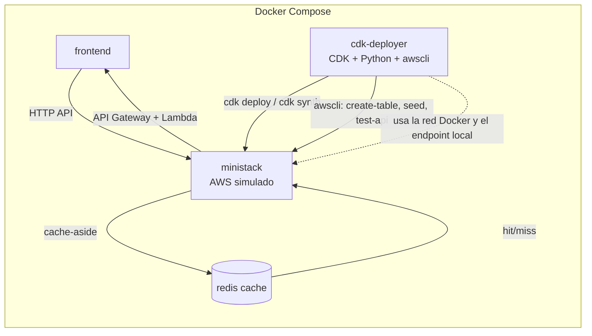

# E-commerce NoSQL

Backend serverless para e-commerce con AWS Lambda, API Gateway HTTP API, DynamoDB y Redis, más un frontend separado en React + Vite. El proyecto está pensado para correr localmente con Docker y MiniStack, y para desplegarse con AWS CDK desde el contenedor `cdk-deployer`.

## Qué incluye

- API serverless en Python 3.11.
- Infraestructura como código con AWS CDK.
- Persistencia en DynamoDB con una tabla principal de tipo single-table.
- Cache con Redis.
- Frontend independiente en `frontend/`.
- Scripts de despliegue, seed y validación en `scripts/`.

## Requisitos

- Docker y Docker Compose.
- `sudo` acceso para ejecutar Docker, o usuario en el grupo `docker`.

No necesitas instalar Python ni AWS CLI en tu máquina principal para usar el flujo normal del proyecto. Las dependencias de infraestructura se preparan dentro del contenedor `cdk-deployer`.

## Estructura

- `infra/`: stacks de CDK y configuración de despliegue.
- `lambdas/`: handlers de API Gateway.
- `app/`: servicios, repositorios, configuración y adaptadores compartidos.
- `scripts/`: creación de tabla, seed, validaciones y utilidades.
- `frontend/`: aplicación React + Vite.



El punto clave es que `cdk-deployer` es quien genera y publica la infraestructura, mientras que `ministack` simula los servicios de AWS que consumen las lambdas, la tabla DynamoDB y la cache Redis.

## Flujo de despliegue local

Este es el flujo recomendado para levantar todo el entorno:

```bash
make up
make deploy
make create-table
make seed
```

Si quieres validar la API después del despliegue:

```bash
make test-api
```

Si quieres ver los logs:

```bash
make logs-ministack
make logs-frontend
```

## Comandos principales

- `make up`: levanta `ministack`, `cdk-deployer`, `redis` y `frontend`.
- `make deploy`: ejecuta `cdk deploy` y escribe `frontend/.env` con la URL real de la API.
- `make create-table`: crea la tabla DynamoDB del proyecto.
- `make seed`: carga datos de prueba en la tabla correcta.
- `make test-api`: verifica que API Gateway y las lambdas respondan.
- `make clean`: detiene el entorno y elimina volúmenes y `cdk.out`.

## Pasos detallados

### 1. Levantar servicios

```bash
make up
```

Esto inicia MiniStack, el contenedor de despliegue, Redis y el frontend.

### 2. Desplegar infraestructura

```bash
make deploy
```

Este paso compila el bundle de las lambdas, despliega la pila de DynamoDB y API Gateway, y deja la URL final escrita en `frontend/.env`.

### 3. Crear la tabla

```bash
make create-table
```

En despliegues normales la tabla ya queda creada por CDK, pero este comando se conserva para asegurar la estructura local cuando se necesita repetir el proceso.

### 4. Cargar datos de prueba

```bash
make seed
```

El seed usa la tabla publicada por CloudFormation, así que evita apuntar a nombres viejos o manuales.

### 5. Probar la API

```bash
make test-api
```

## Ver tablas DynamoDB

Para listar las tablas que ve MiniStack, usa este comando:

```bash
sudo docker compose exec -T cdk-deployer sh -lc '.infra_venv/bin/python3 -m awscli --endpoint-url http://ministack:4566 dynamodb list-tables --output table'
```

Si quieres solo los nombres:

```bash
sudo docker compose exec -T cdk-deployer sh -lc '.infra_venv/bin/python3 -m awscli --endpoint-url http://ministack:4566 dynamodb list-tables --query "TableNames" --output text'
```

## Endpoints útiles

Una vez desplegado, prueba estas rutas:

- `GET /ecommerce/user/1/profile`
- `GET /ecommerce/user/1/orders`
- `POST /ecommerce/user/1/orders`
- `GET /ecommerce/order/<order_id>/details`
- `GET /ecommerce/order/<order_id>/items`
- `GET /ecommerce/user/1/order/<order_id>/details`
- `GET /ecommerce/user/1/order/<order_id>/items`
- `GET /ecommerce/dashboard-data`
- `GET /products`

## Patrón de datos en DynamoDB

La tabla usa claves `PK` y `SK` para modelar usuarios, pedidos y productos.

- Perfil de usuario: `PK = USER#<ID>`, `SK = PROFILE`
- Pedidos recientes: `PK = USER#<ID>`, `SK = ORDER#<timestamp>`
- Detalle de pedido: `PK = ORDER#<ID>`, `SK = DETAILS`
- Ítems de pedido: `PK = ORDER#<ID>`, `SK = ITEM#<ID>`

## Estrategia de cache

El proyecto usa un patrón de **cache-aside** con Redis para las lecturas más repetidas:

- `GET /ecommerce/users`
- `GET /ecommerce/user/{user_id}/profile`
- `GET /ecommerce/user/{user_id}/orders`
- `GET /ecommerce/order/{order_id}/details`
- `GET /ecommerce/order/{order_id}/items`
- `GET /products`
- `GET /ecommerce/dashboard-data`

La idea es simple: primero se consulta Redis; si hay un hit, se devuelve el dato cacheado. Si hay miss, se consulta DynamoDB, se normaliza la respuesta y se guarda en Redis con TTL.

Este patrón encaja bien aquí por tres razones:

- La app es mucho más de lectura que de escritura.
- DynamoDB sigue siendo la fuente de verdad, así que el modelo no se complica.
- El TTL evita que datos viejos vivan demasiado tiempo y hace fácil la consistencia eventual.

Beneficios concretos:

- Menor latencia en pantalla de login, perfil, pedidos y catálogo.
- Menos lecturas a DynamoDB, con menos costo y menos presión sobre la tabla.
- Mejor escalabilidad cuando varios usuarios consultan lo mismo varias veces.
- Fallback natural: si Redis falla, el sistema sigue funcionando contra DynamoDB.

## Frontend

El frontend corre en Vite y consume la API desplegada por CDK. Cuando `make deploy` termina, `frontend/.env` queda actualizado con la URL local correcta.

Para abrirlo:

```bash
sudo docker compose up -d frontend
```

Luego entra a `http://localhost:5173`.

"Si ya hiciste make up entra directamente"

## Apagar todo

```bash
make clean
```

## Colaboradores

- Farit Teran
- Andres Luna
- Daniel Ortiz

El diseño es responsivo y se adapta a escritorio y móvil.

## Pruebas

Una vez levantado el entorno, puedes comprobar que DynamoDB responde:

```bash
sudo docker compose run --rm --entrypoint /bin/sh -e AWS_ENDPOINT_URL=http://ministack:4566 deployer -c 'aws --endpoint-url http://ministack:4566 dynamodb list-tables --no-cli-pager'
```

Si quieres verificar la API agregada desde el handler, puedes invocar directamente la lambda `ecommerce` con `aws lambda invoke` como se muestra arriba.

## Notas sobre Docker

* El servicio `deployer` incluye Python, `awscli` y la CLI de CDK.
* El servicio `ministack` usa la red Docker `ecommerce-net` para ejecutar las Lambdas.
* Si el despliegue falla con permisos, antepone `sudo` a los comandos `docker compose`.

---

## Licencia

Este proyecto es de uso académico - Grupo 2.
