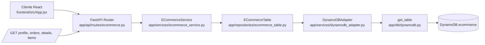

# Flujo Cliente -> API -> Servicios -> Datos

Este documento explica el flujo real de la aplicacion desde que el cliente hace una peticion hasta que se consulta la base de datos, siguiendo una estructura de arquitectura limpia por capas.

## 1. Flujo actual de peticiones

### Frontend (React)

El cliente web en `frontend/src/App.jsx` hace llamadas HTTP a endpoints del backend:

- `GET /ecommerce/user/{user_id}/profile`
- `GET /ecommerce/user/{user_id}/orders`
- `GET /ecommerce/user/{user_id}/order/{order_id}/details`
- `GET /ecommerce/user/{user_id}/order/{order_id}/items`

Estas llamadas se disparan en `useEffect` y luego se unen en un objeto `dashboard` para renderizar la UI.

### Backend (FastAPI)

El backend monta rutas en:

- `app/main.py`: registra routers
- `app/api/routes/ecommerce.py`: define endpoints de ecommerce

Rutas importantes:

- `/profile`, `/orders`, `/details`, `/items` usan `ECommerceService`
- La capa API no accede directo a `DynamoDBAdapter`

### Servicios de negocio

`app/services/ecommerce_service.py`:

- Expone casos de uso de ecommerce para la API
- Normaliza datos crudos a modelos Pydantic
- Aplica reglas de negocio como validacion de pertenencia de pedido

`app/services/ecommerce_dashboard_service.py`:

- Orquesta el caso de uso de dashboard en una sola respuesta agregada
- Reutiliza `ECommerceService`
- Devuelve `DashboardResponse` (modelo Pydantic)
- Se usa en `GET /ecommerce/dashboard-data` (endpoint alternativo para pruebas/integraciones)

### Capa de modelos

`app/models/ecommerce.py` contiene los contratos tipados:

- `UserProfile`
- `OrderSummary`
- `OrderDetails`
- `OrderItem`
- `DashboardResponse`

FastAPI usa estos modelos como `response_model`, por lo que el contrato API queda validado y documentado.

### Repositorio de tabla

`app/repositories/ecommerce_table.py` implementa la abstraccion de acceso por patrones PK/SK:

- `USER#{id} + PROFILE`
- `USER#{id} + ORDER#...`
- `ORDER#{id} + DETAILS`
- `ORDER#{id} + ITEM#...`

### Adapter DynamoDB

`app/services/dynamodb_adapter.py` encapsula boto3:

- `get_item(key: dict)`
- `query_items(...)`
- `put_item(item: dict)`

### Conexion a base de datos

`app/db/dynamodb.py` crea el recurso boto3 y retorna la tabla (`get_table`).

## 2. Diagrama Mermaid del flujo

## 3. Beneficios de la capa modelo implementada

1. Contratos de salida tipados y validados con Pydantic.
2. Menos riesgo por cambios de nombre en campos DynamoDB.
3. Menor acoplamiento de la API con la estructura cruda de la tabla.
4. Documentacion OpenAPI mas clara por `response_model`.

## 4. Resultado arquitectonico

El flujo queda asi:

1. React consume endpoints REST.
2. FastAPI recibe y delega en servicios.
3. Servicios aplican reglas y convierten a modelos.
4. Repositorio abstrae patrones PK/SK.
5. Adapter ejecuta operaciones DynamoDB.

Esto se alinea con una arquitectura limpia por capas, separando presentacion, aplicacion/dominio e infraestructura.

Nota sobre `ECommerceDashboardService`:

- Su funcion es construir una respuesta agregada (`dashboard-data`) para obtener perfil, pedidos, detalle e items en una sola llamada.
- El frontend actual usa varias llamadas separadas (`profile`, `orders`, `details`, `items`), por eso en el diagrama principal se muestra `ECommerceService` como flujo principal.
